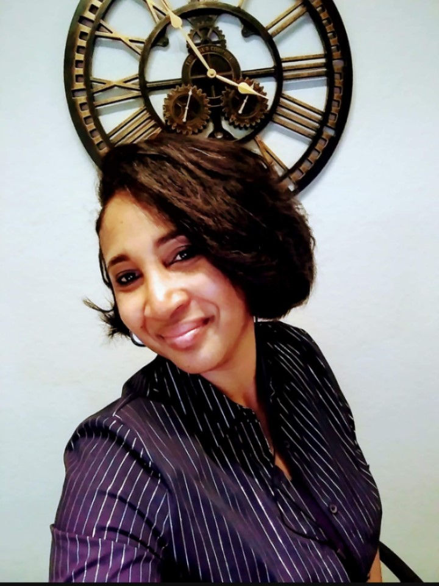

#Alia Hall - Technical Communication Professional
## About Me

-Alia Hall is a Technical and Professional Scholar in UCF's Text and Technology Doctoral Program. 

-Alia's professional experience includes former Program Manager of Lockheed Martin's College Work Experience Program. 

-Alia is also a former corporate Project Manager and Business Analyst. 

-Moreover, her current research interests include: Diversity, Equity, and Inclusion in Technical and Professional Communication; Active Empathetic Listening; and Social Justice Initiatives in Technical Communication. 

-Alia Hall is a McKnight Doctoral Fellowship recipient. .png)
